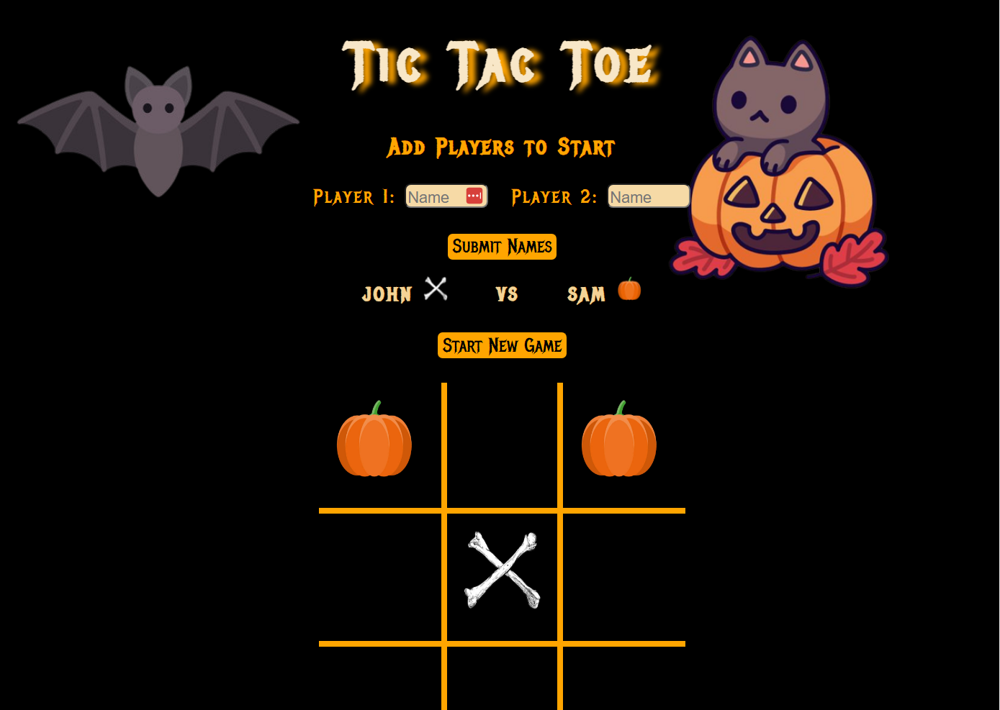

# Tic-Tac-Toe WebPage

This project is a webpage for a TicTacToe game built using react and a locally hosted API included in this repository.

## SetUp Instructions 

#### 1. First ensure that Java 17 is installed to run the API.
#### 2. Clone this repository by clicking the green 'code' sign on top of this page. Click the SSH key and type in your terminal the following: `git clone "git@github.com:hanqing2001/tictactoe_frontend"`.
#### 3. Open up the folder `TicTacToeFinal` in IntelliJ and run the application.
#### 4. Make sure you have SQL downloaded and a database created through Terminal with the command: `createdb tictactoe.`
#### 5. In the project directory on the terminal, run `npm install` followed by `npm start`
#### 6. A webpage should automatically open in your browser displaying the game. If this does not occur, go to the address `http://localhost:3000`

## Preview

